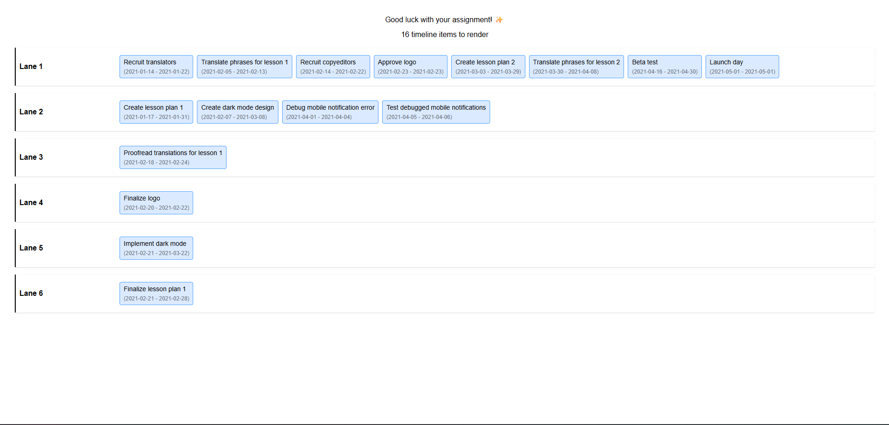
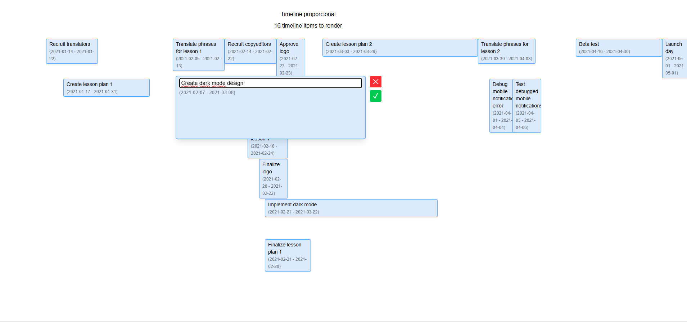

## Installation

1. Clone the repository:

   ```sh
   git clone https://github.com/your-username/timeline.git

   cd timeline

   npm install

   npm run start

   ```

# Timeline Challenge

Honestly, I didn't understand how you wanted the timeline layout to be. When I think of a timeline, something like this comes to mind:

- [Aceternity Timeline](https://ui.aceternity.com/components/timeline)
- [OriginUI Timeline](https://originui.com/search?tags=timeline)
- [Shadcn Blocks Timeline 4](https://www.shadcnblocks.com/block/timeline4)
- [Shadcn Blocks Timeline 2](https://www.shadcnblocks.com/block/timeline2)

But the description in your readme confused me, so to better understand the challenge rules, I asked GPT for help to analyze and interpret the description, and the layout it suggested was something like this:




It didn't seem right to me, but honestly, I was confused about what I should create. According to GPT's interpretation, it would be something similar to Google Calendar, but much simpler, where the size of the event would be based on the date.

Creatively speaking, starting absolutely from scratch, without any inspiration and in a short time, I'm not very strong. And it's not that I lack creativity, but creativity takes time. Anyway, here are 2 of my works:

- [My website with Greensock (GSAP) animations](https://www.batim.com.br/)
- [My wife's store website](https://www.bellartecroche.com.br/)

## Suggestion

To make future challenges easier, please include at least one reference image of the expected layout.
